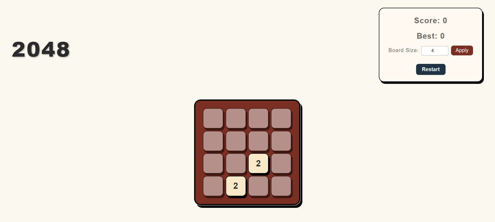

# 2048 Game

A responsive and interactive implementation of the classic **2048 game** built with **React**, **Redux Toolkit**, and **TypeScript**. The game features dynamic board sizes, keyboard and swipe controls, and tracks both the current score and best score.

**Deployed Link:** [2048 Game](https://2048-joelbkoshy.vercel.app)

---

## Features

* **Responsive design**: Works well on desktop, tablet, and mobile.
* **Customizable board size**: Choose between 2x2 and 10x10 grids.
* **Keyboard and swipe support**: Play using arrow keys or touch gestures.
* **Score tracking**: Displays current score and best score.
* **Win/Lose detection**: Alerts when you reach 2048 or no moves remain.
* **Stylish tiles**: Each tile has a unique color and animation for winning tiles.

---

## Screenshot



---

## Tech Stack

* **React** – Frontend library for building UI
* **Redux Toolkit** – State management
* **TypeScript** – Strongly typed code
* **Vercel** – Deployment platform
* **CSS / Flexbox / CSS Variables** – Styling and responsive layout

---

## Installation

1. Clone the repository:

```bash
git clone https://github.com/joelbkoshy/2048.git
cd 2048
```

2. Install dependencies:

```bash
npm install
```

3. Start the development server:

```bash
npm start
```

4. Open your browser at:

```
http://localhost:3000
```

---

## Usage

* **Arrow keys** – Move tiles up, down, left, or right
* **Swipe gestures** – Use on mobile to move tiles
* **Board Size** – Change the board size and click "Apply"
* **Restart** – Reset the game at any time

---

## Folder Structure

```
2048/
├── src/
│   ├── components/      # Board, ScoreBoard, UI components
│   ├── store/           # Redux store and slices
│   ├── utils/           # Game logic functions
│   ├── types/           # TypeScript types
│   ├── App.tsx          # Main App component
│   ├── index.tsx
│   └── styles/          # CSS files
├── public/
├── package.json
└── README.md
```

---

## License

This project is open-source and available under the MIT License.
